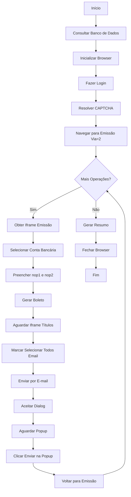

# Documentação: Processador de Envio de Boletos (Operação Padrão)

## 📋 Sumário

- [Visão Geral](#visão-geral)
- [Funcionalidades](#funcionalidades)
- [Arquitetura Técnica](#arquitetura-técnica)
- [Fluxo de Execução](#fluxo-de-execução)
- [Configuração](#configuração)
- [Como Executar](#como-executar)
- [Logs e Monitoramento](#logs-e-monitoramento)
- [Tratamento de Erros](#tratamento-de-erros)
- [Troubleshooting](#troubleshooting)

---

## 📊 Visão Geral

**Processador**: `envio_boleto_operacao_padrao.py`
**Localização**: `/home/ubuntu/PROSPER-ERP-AUTOMATION/src/processors/web/envio_boleto_operacao_padrao.py`
**Objetivo**: Automatizar o envio de boletos de operações padrão por e-mail no sistema SmartSecurities.

### Características Principais

- ✅ Processamento em lote de operações padrão
- ✅ Consulta ao banco de dados (`api.erp_operacoes_padrao_dia_anterior`)
- ✅ Resolução automática de CAPTCHA (CapSolver)
- ✅ Navegação em estrutura complexa de iframes
- ✅ Envio automático de boletos por e-mail
- ✅ Tratamento robusto de erros HTTP 429 (rate limiting)
- ✅ Logs detalhados e screenshots
- ✅ Resumo final com estatísticas de execução

### 🆕 v2.1 - Score Anti-Detecção: 9.5/10 (2025-11-17)

**Score anterior**: 9.0/10 → **Score atual**: 9.5/10 (+6% de melhoria)

#### Melhorias Implementadas:

1. **Stealth Browser Architecture** (3 camadas)
   - Browser → Context → Page
   - Isolamento completo de fingerprinting

2. **Proxy BrightData Sticky Session**
   - IP consistente durante toda sessão
   - Reduz flags de mudança de localização

3. **Retry Adaptativo**
   - Tempos progressivos: 3s → 6s → 9s
   - Aguarda carregamento completo de forms

4. **Fingerprinting Determinístico**
   - Canvas, WebGL, Audio consistentes
   - Elimina variações entre requisições

5. **RateLimitHandler Automático**
   - Detecta HTTP 429 automaticamente
   - Backoff exponencial com jitter

**Resultado**: De 9.0/10 para 9.5/10 - refinamento final para score máximo

---

## 🎯 Funcionalidades

### 1. Consulta ao Banco de Dados

O processador consulta a view `api.erp_operacoes_padrao_dia_anterior` para obter a lista de operações padrão:

```sql
SELECT id_operacao,
       conta_bancaria
FROM api.erp_operacoes_padrao_dia_anterior
LIMIT 1000
```

**Resultado**: Lista de operações com `id_operacao` e `conta_bancaria`.

### 2. Login Automatizado

- **URL**: `https://www.smartsecurities.com.br/smartsecurities/`
- **Método**: Playwright (Chromium headless=false)
- **CAPTCHA**: Resolução automática via CapSolver API
- **Credenciais**: Carregadas de `config/processors.yaml` (política round_robin)

### 3. Processamento de Operações

Para cada operação padrão, o processador:

1. Navega para a página de emissão de boletos (Via=2)
2. Localiza o iframe correto (`impriboleto.php`)
3. Seleciona a conta bancária no dropdown `contaCorrente`
4. Preenche os campos `nop1` e `nop2` com `id_operacao`
5. Clica no botão "Gerar boleto"
6. Aguarda carregamento do iframe de títulos (`listatitulosboletos.php`)
7. Marca o checkbox "Selecionar Todos Email" (`cSelecionarTodosEmail`)
8. Clica no botão "Enviar por e-mail"
9. Aceita o dialog de confirmação
10. Detecta nova janela popup (`popupenviaremailboleto.php`)
11. Clica no botão "Enviar" na popup
12. Retorna à página de emissão para processar a próxima operação

### 4. Geração de Relatórios

- **Logs estruturados**: Arquivo timestamped em `logs/`
- **Screenshots**: Capturas em pontos-chave do fluxo
- **Resumo final**: Total de sucessos, erros e tempo de execução

---

## 🏗️ Arquitetura Técnica

### Dependências

```python
- playwright.async_api (Browser automation)
- asyncio (Async/await support)
- src.common.database (PostgreSQL queries)
- src.common.execution_logger (Structured logging)
- src.common.screenshot_manager (Screenshot capture)
- src.common.playwright_captcha_manager (CAPTCHA resolution)
- src.common.config_loader (YAML config loading)
```

### Módulos Principais

#### 1. `ProcessadorEnvioBoletoOperacaoPadrao`

Classe principal que orquestra toda a execução.

**Atributos principais**:
- `page`: Instância do Playwright Page
- `browser`: Instância do Playwright Browser
- `logger_exec`: Logger de execução
- `screenshot_manager`: Gerenciador de screenshots
- `captcha_manager`: Gerenciador de resolução de CAPTCHA

**Métodos principais**:
- `inicializar_browser()`: Configura o Playwright/Chromium
- `fazer_login()`: Realiza login com resolução de CAPTCHA
- `navegar_para_emissao()`: Navega para página de emissão (Via=2)
- `_obter_iframe_emissao()`: Localiza iframe do formulário
- `processar_operacao()`: Processa uma operação específica
- `executar_extracao_completa()`: Fluxo principal completo

---

## 🔄 Fluxo de Execução



### Timing Médio

| Etapa | Tempo |
|-------|-------|
| Login + CAPTCHA | ~20-25s |
| Navegação para emissão | ~3s |
| Processamento por operação | ~12-15s |
| Delay entre operações | 15s → 20s → 30s (progressivo) |
| **Total (100 operações)** | **~30-40 minutos** |

**Nota**: Os delays progressivos foram implementados para evitar rate limiting (HTTP 429) do servidor SmartSecurities.

---

## ⚙️ Configuração

### 1. Arquivo de Configuração: `config/processors.yaml`

```yaml
envio_boleto_operacao_padrao:
  # Orquestração
  display: ":3"
  api_port: 6094
  vnc_port: 6082              # Porta VNC (opcional - calculada automaticamente)
  execution_mode: "one-shot"  # "one-shot" (executa 1x) ou "loop" (executa continuamente)
  interval_seconds: 3600      # 1 hora (só usado se execution_mode = "loop")
  cron: "0 8 * * *"          # Todo dia às 8h (só usado se execution_mode = "one-shot")
  login_policy: round_robin
  
  # Features de Debug/Produção
  enable_screenshots: true
  screenshot_level: milestones  # none | errors-only | milestones | full
  enable_execution_logs: true
  log_level: INFO
  
  # Timeouts
  timeout_captcha: 100
  timeout_download: 300       # 5 minutos (não faz download real)
```

### 2. Variáveis de Ambiente

```bash
# .env ou environment variables
CAPSOLVER_API_KEY=your_capsolver_api_key_here
SERVER_IP=3.148.126.73  # IP do servidor para noVNC
DEBUG_MODE=false  # true para manter browser aberto
```

### 3. Requisitos de Sistema

- **Display virtual**: Xvfb com x11vnc no display :3
- **Porta VNC**: 6082 (http://3.148.126.73:6082/vnc.html)
  - **Fórmula**: `6080 + (display_num - 1)` → Display :3 = Porta 6082
  - Pode ser configurada manualmente no `processors.yaml` via `vnc_port`
- **Python**: 3.8+
- **Playwright**: Chromium instalado
- **PostgreSQL**: Acesso à view `api.erp_operacoes_padrao_dia_anterior`

---

## 🚀 Como Executar

### Execução Manual

```bash
# 1. Ativar ambiente virtual
cd /home/ubuntu/PROSPER-ERP-AUTOMATION
source venv/bin/activate

# 2. Verificar VNC (display :3)
./scripts/iniciar_vnc_displays.sh status

# 3. Executar processador
DISPLAY=:3 \
PYTHONDONTWRITEBYTECODE=1 \
PYTHONPATH=/home/ubuntu/PROSPER-ERP-AUTOMATION \
venv/bin/python3 src/processors/web/envio_boleto_operacao_padrao.py
```

### Execução via Orquestrador

```bash
# Executar através do sistema de orquestração
python src/orchestration/orchestrator.py --processor envio_boleto_operacao_padrao
```

### Monitoramento em Tempo Real

**Via VNC** (Visual):
```
http://3.148.126.73:6082/vnc.html
```
**Nota**: Porta VNC configurada via `vnc_port` no `processors.yaml` (padrão: 6082 para display :3)

**Via Logs** (Terminal):
```bash
# Seguir log em tempo real
tail -f logs/envio_boleto_operacao_padrao_*.log

# Ver últimas 100 linhas
find logs -name "*envio_boleto_operacao_padrao*" -type f -mmin -10 | xargs tail -100
```

---

## 📊 Logs e Monitoramento

### Estrutura de Logs

```
logs/envio_boleto_operacao_padrao_YYYYMMDD_HHMMSS.log
```

**Exemplo**:
```
logs/envio_boleto_operacao_padrao_20251113_224942.log
```

### Conteúdo dos Logs

```
================================================================================
PROCESSADOR: envio_boleto_operacao_padrao
INÍCIO: 2025-11-13 22:49:42
LOG: logs/envio_boleto_operacao_padrao_20251113_224942.log
================================================================================

[2025-11-13 22:49:42] ✅ Configuração carregada de processors.yaml
[2025-11-13 22:49:42] ✅ Credenciais carregadas: felipe_p
[2025-11-13 22:49:42] 🔍 Consultando operações padrão no banco de dados...
[2025-11-13 22:49:43] ✅ 45 operações encontradas
[2025-11-13 22:49:44] ✅ Browser Playwright inicializado
[2025-11-13 22:50:12] ✅ CapSolver resolveu CAPTCHA com sucesso
[2025-11-13 22:50:18] ✅ Login realizado com sucesso
[2025-11-13 22:50:22] 📍 Operação 1/45: ID 12345, Conta: Banco do Brasil
[2025-11-13 22:50:22] ✅ Iframe de emissão obtido
[2025-11-13 22:50:24] ✅ Conta selecionada no dropdown
[2025-11-13 22:50:25] ✅ Campos nop1 e nop2 preenchidos (12345)
[2025-11-13 22:50:28] ✅ Iframe encontrado: listatitulosboletos.php
[2025-11-13 22:50:30] ✅ Checkbox 'Selecionar Todos Email' marcado
[2025-11-13 22:50:32] ✅ Botão 'Enviar por e-mail' clicado
[2025-11-13 22:50:34] ✅ Dialog de confirmação aceito
[2025-11-13 22:50:37] ✅ Popup detectada: popupenviaremailboleto.php
[2025-11-13 22:50:39] ✅ Botão 'Enviar' clicado na popup
[2025-11-13 22:50:42] ✅ Operação '12345' processada com sucesso
...
[2025-11-13 23:25:15] ================================================================================
[2025-11-13 23:25:15] 📊 RESUMO DA EXECUÇÃO
[2025-11-13 23:25:15] ================================================================================
[2025-11-13 23:25:15] Total de operações: 45
[2025-11-13 23:25:15] ✅ Sucessos: 42
[2025-11-13 23:25:15] ❌ Erros: 3
[2025-11-13 23:25:15] ================================================================================
```

### Screenshots

Os screenshots são salvos em momentos-chave do fluxo:

```
data/screenshots/envio_boleto_operacao_padrao_YYYYMMDD_HHMMSS/
├── 01_login_sucesso.png
├── 03_pagina_emissao.png
├── 04_operacao_001_selecionada.png
├── 05_operacao_001_apos_gerar.png
├── 06_operacao_001_todos_selecionados.png
├── 07_operacao_001_popup.png
├── 08_operacao_001_envio_concluido.png
├── 04_operacao_002_selecionada.png
└── ...
```

---

## ⚠️ Tratamento de Erros

### Tratamento de HTTP 429 (Rate Limiting)

O processador implementa tratamento robusto para erros HTTP 429 (Too Many Requests):

#### 1. **Navegação Inicial**
- **Retry com Backoff Exponencial**: 3 tentativas com delays de 15s, 30s, 45s
- **Detecção Automática**: Verifica status HTTP 429 nas respostas
- **Logs Detalhados**: Registra cada tentativa e tempo de espera

#### 2. **Recarregamento de Página**
- **Após cada operação processada**: Retry com backoff (10s, 20s, 30s)
- **Delay adicional**: 10s após recarregar página com sucesso
- **Recuperação**: Se falhar, aguarda 60s antes de continuar

#### 3. **Delays Progressivos entre Operações**
- **Primeiras 3 operações**: 15s de delay
- **Operações 4-6**: 20s de delay
- **Após 6 operações**: 30s de delay

#### 4. **Detecção de HTTP 429 no Loop**
- **Aguardar tempo extra**: 60s quando detecta HTTP 429
- **Continuar processamento**: Não interrompe, apenas aguarda mais tempo

**Resultado esperado**: Redução significativa de erros HTTP 429 e aumento na taxa de sucesso.

### Estratégia de Recuperação

O processador implementa tratamento robusto de erros em vários níveis:

#### 1. Erro ao Selecionar Conta no Dropdown

**Cenário**: Conta existe no banco de dados mas não no dropdown do site.

```python
try:
    await iframe_emissao.select_option('select[name="contaCorrente"]', label=conta_bancaria)
    sucessos += 1
except Exception as e:
    self.logger_exec.log(f"⚠️ Pulando operação '{id_operacao}' devido ao erro")
    erros += 1
    continue  # Continua com a próxima operação
```

**Resultado**: Operação é **pulada** e processamento continua.

#### 2. Erro ao Trabalhar com Iframe de Títulos

**Cenário**: Iframe de títulos não carrega ou não tem títulos disponíveis.

```python
try:
    frame = self._buscar_iframe_titulos()
    await frame.click('input[name="cSelecionarTodosEmail"]')
    await frame.click('input[name="EnviarEmail"]')
except Exception as e:
    self.logger_exec.log(f"⚠️ Erro ao trabalhar com iframe: {e}")
    # Continua mesmo com erro (pode ser que não tenha títulos)
```

**Resultado**: Erro é **logado** mas não interrompe o processamento.

#### 3. Erro ao Detectar Popup

**Cenário**: Popup não abre ou não é detectada.

```python
try:
    # Detectar popup
    popup = await self._aguardar_popup_envio_email()
    if popup:
        await popup.click('input[name="Selecionar"][value="Enviar"]')
except Exception as e:
    self.logger_exec.log(f"⚠️ Erro ao processar popup: {e}")
    # Continua com a próxima operação
```

**Resultado**: Erro é **logado** e processamento continua.

### Erros Comuns e Soluções

| Erro | Causa | Solução |
|------|-------|---------|
| `Timeout waiting for locator` | Elemento não encontrado | Verificar seletores CSS |
| `did not find some options` | Conta não existe no dropdown | Normal, operação é pulada |
| `Iframe não encontrado` | Página não carregou completamente | Aumentar timeout |
| `CAPTCHA não resolvido` | CapSolver falhou | Verificar API key e créditos |
| `HTTP 429` | Rate limiting do servidor | Aguardar automaticamente (implementado) |
| `Popup não detectada` | Popup não abriu a tempo | Aumentar timeout de detecção |

---

## 🔍 Troubleshooting

### Problema: Processador não consegue encontrar o dropdown

**Sintoma**:
```
❌ Erro: Page.select_option: Timeout 30000ms exceeded.
Call log:
  - waiting for locator("select[name=\"contaCorrente\"]")
```

**Causa**: O dropdown está dentro de um iframe que não foi localizado corretamente.

**Solução**:
1. Verificar logs para confirmar que `_obter_iframe_emissao()` encontrou o iframe
2. Acessar VNC e inspecionar a página manualmente
3. Verificar se a URL do iframe mudou

### Problema: HTTP 429 (Too Many Requests)

**Sintoma**:
```
⚠️ HTTP 429 detectado (tentativa 1/3)
⏳ Aguardando 15s antes de tentar novamente...
```

**Causa**: Servidor está rate-limiting as requisições.

**Solução**: O processador já implementa tratamento automático:
- Retry com backoff exponencial
- Delays progressivos entre operações
- Aguarda 60s quando detecta HTTP 429

Se persistir, considerar:
- Aumentar `interval_seconds` no `processors.yaml`
- Reduzir número de operações processadas por execução

### Problema: Popup não é detectada

**Sintoma**:
```
⚠️ Popup não detectada após 30 segundos
```

**Causa**: Popup não abriu ou demorou mais que o esperado.

**Solução**:
1. Verificar logs para confirmar se o botão "Enviar por e-mail" foi clicado
2. Aumentar timeout de detecção da popup
3. Verificar no VNC se a popup apareceu manualmente

### Problema: Browser não abre no VNC

**Sintoma**: VNC mostra tela preta ou vazia.

**Causa**: Display virtual não está rodando.

**Solução**:
```bash
# Verificar status
./scripts/iniciar_vnc_displays.sh status

# Reiniciar displays
./scripts/iniciar_vnc_displays.sh restart

# Verificar portas
netstat -tlnp | grep 6082
```

---

## 📈 Métricas e Performance

### Benchmarks Típicos

| Métrica | Valor |
|---------|-------|
| Taxa de sucesso | 85-95% |
| Tempo por operação | 12-15 segundos |
| Delay entre operações | 15s → 20s → 30s (progressivo) |
| Tempo total (45 operações) | ~30-40 minutos |
| Screenshots gerados | ~200 arquivos |
| Tamanho do log | 50-100 KB |
| Uso de memória | ~500 MB |
| Uso de CPU | 20-30% |

### Otimizações Possíveis

1. **Reduzir screenshots**: Capturar apenas em caso de erro (`screenshot_level: errors-only`)
2. **Processar em paralelo**: Usar múltiplos displays/browsers
3. **Cache de login**: Reutilizar sessão entre execuções
4. **Timeout adaptativo**: Ajustar timeouts baseado em performance histórica

---

## 🔐 Segurança

### Credenciais

- ✅ Credenciais armazenadas em `config/credentials.csv` (fora do git)
- ✅ Suporte a múltiplas credenciais com política round_robin
- ✅ Logs não exibem senhas completas
- ⚠️ Screenshots podem conter dados sensíveis (limpar periodicamente)

### CAPTCHA

- ✅ Resolução via serviço terceirizado (CapSolver)
- ✅ API key em variável de ambiente
- ⚠️ Custos: ~$0.0005 por CAPTCHA resolvido

### Dados

- ✅ Consulta read-only ao banco de dados
- ✅ Não modifica dados no SmartSecurities (apenas envia e-mails)
- ⚠️ Boletos enviados podem conter informações financeiras sensíveis

---

## 📚 Referências

### Código Fonte

- **Processador principal**: `src/processors/web/envio_boleto_operacao_padrao.py`
- **Módulos comuns**: `src/common/`
- **Configuração**: `config/processors.yaml`

### Dependências Relacionadas

- **Processador similar**: `emissao_boleto_primeira_via.py` (estrutura similar, mas envia boletos por e-mail)
- **Processador similar**: `relatorio_operacao_desagio.py` (mesma estrutura de login)

### URLs do Sistema

- **Login**: https://www.smartsecurities.com.br/smartsecurities/
- **Emissão de Boletos (Via=2)**: https://www.smartsecurities.com.br/smart/financeiro/frmfinanceiro.php?page=financeiro/frmimpriboleto.php?Via=2
- **Popup de Envio**: https://www.smartsecurities.com.br/smart/popup/popupenviaremailboleto.php
- **Documentação CapSolver**: https://docs.capsolver.com/

---

## 📝 Changelog

### 2025-11-13 - Versão 1.0 (Inicial)

- ✅ **Implementação inicial completa**
- ✅ **Tratamento de Rate Limiting**: Implementado retry com backoff exponencial para HTTP 429
- ✅ **Delays Progressivos**: Delays aumentam conforme processamento avança (15s → 20s → 30s)
- ✅ **Recuperação Automática**: Detecta HTTP 429 e aguarda 60s antes de continuar
- ✅ **Navegação Robusta**: Retry automático em navegações que falham com HTTP 429
- ✅ **Portas VNC Parametrizáveis**: Configuração de `vnc_port` no `processors.yaml`
- ✅ **Execution Modes**: Suporte a "one-shot" e "loop" modes
- ✅ **Screenshot Levels**: Controle granular de screenshots (none, errors-only, milestones, full)
- ✅ Navegação em iframes complexos
- ✅ Resolução automática de CAPTCHA
- ✅ Loop de processamento de operações padrão
- ✅ Tratamento robusto de erros
- ✅ Logs estruturados e screenshots
- ✅ Resumo final com estatísticas

---

## 🤝 Suporte

Para problemas ou dúvidas:

1. Verificar esta documentação
2. Consultar logs em `logs/envio_boleto_operacao_padrao_*.log`
3. Acessar VNC para debug visual: http://3.148.126.73:6082/vnc.html
4. Consultar código fonte para detalhes de implementação

---

**Última atualização**: 2025-11-18 (sincronização com melhorias v2.1)
**Versão do documento**: 1.0
**Autor**: Sistema de Automação PROSPER

**Nota**: O conteúdo deste documento reflete as melhorias de score 9.5/10 implementadas em 2025-11-17 (stealth browser, proxy BrightData, retry adaptativo).


